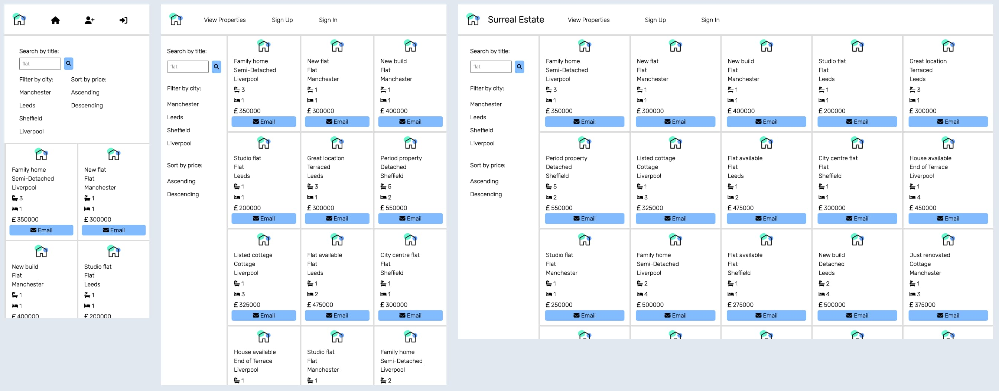

# Surreal Estate

 

- I'm currently building this app using React, JavaScript and CSS.  
- I'm writing the tests using Jest and React Testing Library.
- This project was created using the npx script `create-react-app`.

## Features
- Users can navigate to different parts of the app using the navbar.
- On the landing page, users can search for properties by title, filter by location or sort by price.
- Users can start drafting an email enquiry by clicking the `Email` button on each property card.
- Once users have created an account, they can sign in to add a property listing.
- Signed in users also have access to a `Saved Properties` section where they can save and remove property cards.

## Installation
- Create a fork of this repo.
- Copy the fork's git address and clone to your machine using git clone.
- Use `npm install` to download the dependencies.
- Use `npm test` to run the tests.
- Use `npm start` to run the app in your browser.

